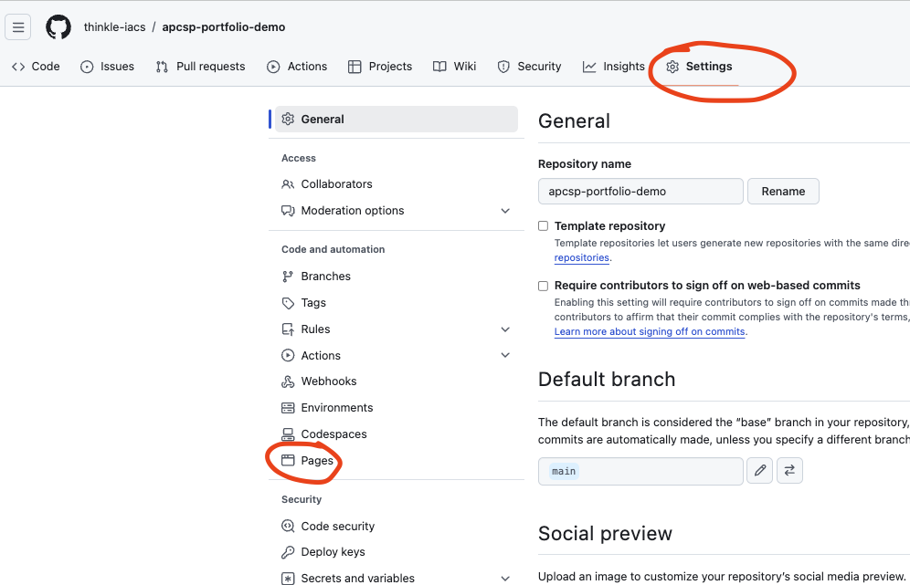
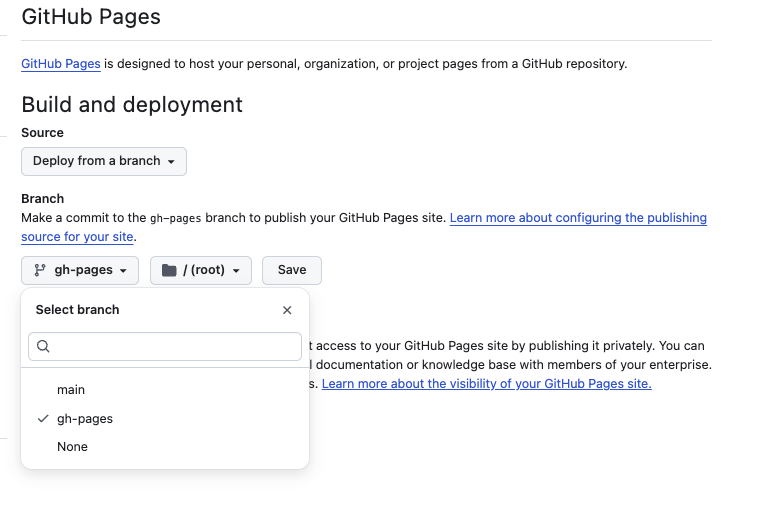
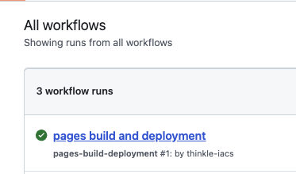
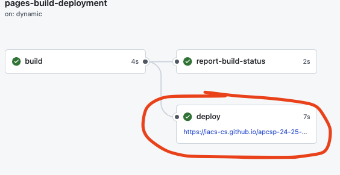

# Publishing

## How to Publish your Page

Go to your Github Repository for your project.
Go to Settings, then Pages

Once you're there, choose the Source "Deploy from a branch" and the "Branch" gh-pages (with "/ (root)") and click save.

At this point, github will deploy your page. If your github repo is at a URL like:

`https://github.com/IACS-CS/apcsp-portfolio-my-example/`

Then your page will deploy to a page like:

`https://iacs-cs.github.io/apcsp-portfolio-my-example/`

You can confirm it works by clicking on the **Actions** tab on the top of github.

You will see a workflow running -- when it completes, it will have a green checkmark icon.

If you click on the workflow, it will show you the link, which will also be available via the "Deployments"
option on the left tab.

